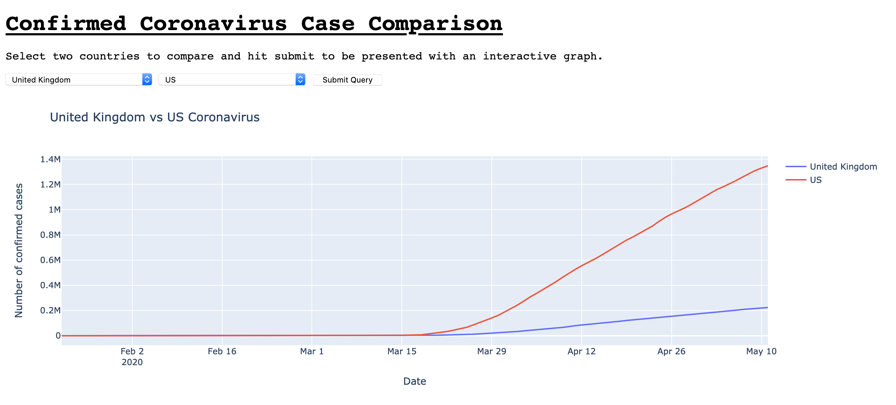

# Coronavirus_Flask

## WHAT IS IT
Uses a COVID19 API to compare 2 countries by the number of confirmed coronavirus cases. Most countries available.

Runs on a Flask app in browser.

Returns - Interactive HTML Plotly graph.

## HOW TO USE

1. git clone &lt;url&gt; for corona_virus_flask repository

2. create a virtual environment
    - python3 -m venv venv/       -Creates an environment called venv/ you can replace “venv/” with a different name for your environment.

3. activate the virtual envrionment
    - source venv/bin/activate

4. IF NECCESSARY -> install requirements
   - pip install -r requirements.txt       - Install the packages from the requirements file
   - pip freeze > requirements.txt       - Store the current packages in a txt file

## EXAMPLE

